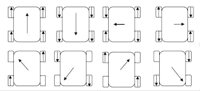

# Information on Tensorflow and Mecanum Algorithms

The main goals of the algorithms detailed on the following pages is to:
1. Make the robot more effective in autonomous
2. Make the robot easier for the drivers to control

The first goal is achieved through the Tensorflow algorithm. By processing the image gathered by the webcam and using Tensorflow to detect the position of the gold mineral *while the robot is moving*, we save a great deal of time compared to running in linear time. By using this data to determine which mineral to drive to and knock off, we score more points more reliably and faster than with another method, say color sensor.

The second goal is achieved through the Mecanum algorithm. Mecanum wheels provide omnidirectional movement, and without the proper algorithm a driver would not be able to realize its full potential. True omnidirectional and omnirotational movement can be achieved only through combining a variety of driver inputs in order to produce the nessecary driver output. Our driving system is based off of the movement of most games nowadays, where moving is controlled using the left stick and looking around (or in our case, rotating) is controlled using the right stick. Our algorithm makes it easy for the driver to do this!

# Evolution of the image processing system

The main goal of our image recognition is to detect the position of the minerals using a webcam(Logitech C920), in order to knock the gold of its post.

## Attempt 1 - Vuforia Object Scanner

Since last year, we had used Vuforia to detect and identify the VuMarks, our first idea this year was to extend Vuforias usage into the third dimension. Vuforia has a built in 3D object recognition in their Vuforia Object Scanner Android app. So, we created a model of the gold and silver minerals and uploaded them to a Vuforia target database.


However, **the implementation of detecting these objects in an android app was not well documented online.** I attempted to repurpose the FTC SDK's built-in Vuforia recognizer to use the 3D models instead of just VuMarks. This proved to be quite challenging for me, though, so through quests online I stumbled on what would be our next attempt.

## Attempt 2 - Vuforia → OpenCV → EnderCV 

OpenCV has been more well documented by FTC teams than Vuforia has. There are several libraries and tools which I discovered which had the possibility of working for detecting the minerals. One library, EnderCV, developed by team 5484 the EnderBots(who may or may not be at this competition), had all of the basics which I was looking to implement. Their library has classes, which, with one implementation could detect colors in an image and report their relative location to an OpMode. 

**However, the major drawback, which ended up not allowing us to use this fantastic library, is my relative failure to figure out how to use it with a webcam.** All of its vuforia-calling methods are in several factories and generators, and I could not for the life of me figure out how to change what should have been 3 lines of code to use the webcam instead of the phone. In the documentation to EnderCV I did find the program GRIP, which I would use for the next attempt.

## Attempt 3 - Vuforia → GRIP

GRIP is the Graphically Represented Image Processing Engine. It provides a graphical interface, in which you can transform an input to detect certain things. The wide variety of processing GRIP has availble, and the **ability to export one's transformations into Java code** made it seem like a likely contender for being effective. I first created a series of transformations which would isolate certain aspects of the gold and silver minerals.

### 1. Blur to remove noise


### 2. Isolate gold mineral by hue**


### 3. Apply mask and track contours**


GRIP was going well, when FTC changed our whole gameplan with the release of FTC SDK 4.2.

## Attempt 3.5 - Vuforia → OpenCV → DogeCV

Developed by the mechanical masterminds, DogeCV is another image recognition which claimed to recognize colors. However, this was merely a side project as I concentrated on GRIP.

## Attempt 4 - Vuforia → Tensorflow Model

SDK 4.2 introduced support for Google's Tensorflow Lite library to detect, with a pre-trained machine learning model, gold and silver minerals. At first, we simply tried to finish up the GRIP system. However, taking too long was a major issue - our competition was in around 3 weeks. Plus, an official FTC system for detecting the minerals would make our lives in the future much safer, with official updates and bugfixes.

The only issue with Tensorflow is that it is not compatible with Android versions below 6.0. So, we had a decision to make: continue with GRIP and sacrifice the benefits of TF, or buy a whole new phone. Our choice: buy Moto G4 Play phones.

With the new phones we set about incoroporating TF into our autonomous programs. Thanks to the sample opmode, ConceptTensorFlowObjectDetectionWebcam we had an official source off of which we could build our program. As usual, we ran the sample to see if it would work with our system. We had to learn to use a USB hub to connect both the webcam and REV expansion hub. As it worked, we wanted to streamline and make more efficient the entire process.

Our choice was to place all of Vuforia and Tensorflow into a single class, which could be called as an object and used in any other class. VuforiaTracking.java contains the nessecary functions to initialize Vuforia, initialize Tensorflow, activate Tensorflow, and a function to get the position of the gold.

VuforiaTracking.java
```java
//return a string with a position in it, if none is found return unknown
String getPosition() {
    String result = "UNKNOWN";
    if (tfod != null) {
        // getUpdatedRecognitions() will return null if no new information is available since
        // the last time that call was made.
        List<Recognition> updatedRecognitions = tfod.getUpdatedRecognitions();
        if (updatedRecognitions != null) {
            numDetected = updatedRecognitions.size();
            if (updatedRecognitions.size() == 3) {
                //-1 means not yet detected
                int goldMineralX = -1;
                int silverMineral1X = -1;
                int silverMineral2X = -1;
                //loop through all the found objects, and label each with their respective x values
                //(there should be three distinct)
                for (Recognition recognition : updatedRecognitions) {
                    if (recognition.getLabel().equals(LABEL_GOLD_MINERAL)) {
                        goldMineralX = (int) recognition.getLeft();
                    } else if (silverMineral1X == -1) {
                        silverMineral1X = (int) recognition.getLeft();
                    } else {
                        silverMineral2X = (int) recognition.getLeft();
                    }
                }
                        /*if all are detected and are distinct, 
                        if gold is to the left of both silver 1 and 2, it is in position left. 
                        if gold is to the right of both silver 1 and 2, it is in position right. 
                        any other position is the center
                         */
                if (goldMineralX != -1 && silverMineral1X != -1 && silverMineral2X != -1) {
                    if (goldMineralX < silverMineral1X && goldMineralX < silverMineral2X) {
                        result = "LEFT";
                    } else if (goldMineralX > silverMineral1X && goldMineralX > silverMineral2X) {
                        result = "RIGHT";
                    } else {
                        result = "CENTER";
                    }
                }
            }
        }
    }
}
```
This function returns a string with the position of the GOLD mineral, and this is used in the Autonomous programs to figure out which position to go to. However, if running the Autonomous program in a LinearOpMode, one can only run this getPosition() function once after every move. This system would be very unreliable. We wrote a debug program to see which position the mineral is in *checked every game tick.* We found that it sometimes flickers back and forth between "THE CORRECT RESULT" and "UNKNOWN". If we had checked it only once after every move, we would have had quite a high probability of receiving the wrong result.

So, in each Autonomous program we use multi-threading to run the vision computation in the background. This allows us to continuously run the program *while the robot is still performing moves*. Even more importantly, we can run the thread *just* until it returns a result. In this way, it is almost guaranteed that we will receive a result by the time we need to act on it.

Autonomous1.java
```java
/*
    we create a new thread, 
    separate from the main thread in order to run 
    the vision processing while the robot is moving.
    the thread will only run until a valid position is found. 
    this helps with an issue with detecting more than 3 objects or less than 3.
    however, the main thread will only check to see 
    if the thread has returned a result after each move.
*/

new Thread(new Runnable() {
    @Override
    public void run() {
        if (opModeIsActive() && tracking.tfod != null) {
            POSITION_GOLD = "UNKNOWN"; //combat NullPointerException
                while (POSITION_GOLD.equals("UNKNOWN")) {
                    pos = tracking.getPosition();
                        if (!pos.equals("UNKNOWN")) {
                            POSITION_GOLD = pos;
                        }
                    }
                }
            }
}).start();
``` 

This code is one of the most vital in the entire program. After it receives it's result, it places it into a String POSITION_GOLD. When the main thread is free(after a move), it checkes POSITION_GOLD, which after several checks will almost definitely have the result. See this awesome system in action during one of our games.

## Future goals

- Right now, we have tape on the top of the webcam to try and stop it from seeing minerals in the background (facing the crater). We are going to perfect the position of the tape.
- I am planning to add more exception handling. For the *very rare* case that tensorflow does detect less than 3 or greater than 3 objects, it will not currently send a result.
  - I have an idea to improve the probabilities of correct results if these cases happen.
  ```
  if(numberDetected == 2)
    if(posG1 != -1)
      if(posS1 != -1 || posS2 != -1)
        if(posG1 > posS1 && posS1 != -1)
          G1 is either in position 2 or 3
        same for G2
        if(posG1 < posS1 && posS1 != -1)
          G1 is either in position 1 or 2
  ```
  - This will improve our probability from 33% to 50%, a significant improvement.
  ```
  if(numDetected > 3)
    find the objects with the least confidence, and delete until we only have 3 left
  ```
  - This will get us down to a hopefully correct 3 object system.
  - An issue: we usually can get down to a 3 object system after a certain amount of time. So, we make var called minimumCycles that has to be reached before the actual exceptions can be used.

# 2-Mineral Strategy and Elimination Strategy

### 2-Mineral Strategy ( + Classifications)

At the Rochester and Saquoit qualifiers, we ran into the problem of having too narrow of a field of vision from our webcam to reliably spot all three minerals. We wanted to fix the webcam in a position in order to increase reliability. So, we came up with a new strategy while altering positions of the webcam: specifically point the webcam at the LEFT and CENTER minerals, which will still allow us to determine the position of the gold mineral through the algorithm below. This system is implemented as follows:

VuforiaTracking.java
```java
String compareRecognitions(List<Recognition> r) {

    String result = "UNKNOWN";
    
    Classification obj1 = new Classification(-1, "UNKNOWN");
    Classification obj2 = new Classification(-1, "UNKNOWN");
    
    // first sort values by x coordinate
    // loop through all the found minerals, and label each with their respective x values
    // (there should be two distinct)

    Collections.sort(r, new Comparator<Recognition>() {
        @Override
        public int compare(Recognition a, Recognition b) {
            return (int) a.getLeft() - (int) b.getLeft();
        }
    });

    for (Recognition recognition : r) {

        if(obj1.getX() == -1) {
            obj1.setX( (int) recognition.getLeft());
            obj1.setLABEL(recognition.getLabel());
        } else {
            obj2.setX( (int) recognition.getLeft());
            obj2.setLABEL(recognition.getLabel());
        }

    }

                        /*
                            if both objects exist:
                                if the leftmost one is silver and so is the center, 
                                    then the RIGHT is GOLD
                                if the center is gold, 
                                    then the CENTER is GOLD
                                if the leftmost one is gold, 
                                    then the LEFT is GOLD
                        */

    if (obj1.getX() != -1 && obj2.getX() != -1) {

        if(obj1.getLABEL().equals(LABEL_SILVER_MINERAL) && 
           obj2.getLABEL().equals(LABEL_SILVER_MINERAL)) {
            result = "RIGHT";
        } else if(obj2.getLABEL().equals(LABEL_GOLD_MINERAL)) {
            result = "CENTER";
        } else if(obj1.getLABEL().equals(LABEL_GOLD_MINERAL)) {
            result = "LEFT";
        } else {
            result = "UNKNOWN";
        }
    }

    return result;

}
```

In this method, we implement object-oriented programming by creating a new object, the Classification. This object is a simplified version of the Recognition object which only has a label and a left-position.

VuforiaTracking.java
```java
class Classification {

    int x;
    String LABEL;

    Classification(int posX, String CLASS) {

        x = posX;
        LABEL = CLASS;

    }

    public int getX() {return x;}

    public void setX(int x) {this.x = x;}

    public void setLABEL(String LABEL) {this.LABEL = LABEL;}

    public String getLABEL() {return LABEL;}
    
}
```

This allows us to compare minerals quite easily, and makes the code quite readable.

### Elimination strategy

When our robot faces the crater, we have the problem of detecting too many minerals. Some runs we only detect two, but on others we detect seven or eight. This poses a great challenge to the above described 2-Mineral Strategy.

After the Saquoit qualifier, one of the ideas in the back of my head was to eliminate the crater minerals based on the TensorFlow confidence level. However, with some debugging, we realized there are some runs where the crater minerals are actually more confident than the sampling minerals. So, we switched to using the actual position of the minerals to eliminate. 

What we ended up creating was a relatively simple, yet effective algorithm. Instead of our previous reliance on physically blocking the top half of the webcam, we now have a system which works at extremely close to 100% accuracy. The "elimination" method is implemented as shown below.

```java
String getPositionByElimination() {

    String result = "UNKNOWN";

    if (tfod != null) {
        // getUpdatedRecognitions() will return null if no new information is available since
        // the last time that call was made.
        List<Recognition> updatedRecognitions = tfod.getUpdatedRecognitions();

        if (updatedRecognitions != null) {

            numDetected = updatedRecognitions.size();
            
            //there are two minerals, so run as normal
            
            if (numDetected == 2) {

                result = compareRecognitions(updatedRecognitions);

            //there are more than two minerals, so eliminate
            } else if(numDetected > 2) {
            
                //sort by TOP distance
                Collections.sort(updatedRecognitions, new Comparator<Recognition>() {
                    @Override
                    public int compare(Recognition r1, Recognition r2) {
                        return Integer.valueOf( (int) r1.getTop()).compareTo((int) r2.getTop());
                    }
                });

                //remove the minerals that are at the TOP until there are just 2
                while(updatedRecognitions.size() > 2) {

                    updatedRecognitions.remove(0);

                }
                
                //run the usual compare algorithm
                result = compareRecognitions(updatedRecognitions);

            }
        }
    }

    //in debug we encountered a nullpointerexception so these lines are probably important
    if (result != null) {
        return result;
    } else {
        return "UNKNOWN";
    }
}
```

In this, we don't need to run the elimination if there are already only two minerals. However, if there are more than two, we:
1. Sort the list of recognitions by their TOP position
2. Eliminate recognitions from the list by index 0 aka the minerals in the crater which the webcam has seen
3. Now, we have a list of size 2, and we can run the compareRecognition algorithm to find the position of the real gold mineral.

We can still use this algorithm with multi-threading.

This algorithm is simple, yet effective! Come watch us sample in the competition!
  
# Information on mecanum drive algorithm

Philbot's code for omnidirectional drive of a three-wheeled system gave me the inspiration to try and develop it for a mecanum system. The code for the algorithm is as follows.

```java
void manualDrive() {
    // In this mode the Left stick moves the robot fwd & back, and Right & Left.
    // The Right stick rotates CCW and CW.
    setAxial(-myOpMode.gamepad1.left_stick_y);
    setLateral(myOpMode.gamepad1.left_stick_x);     
    setYaw(myOpMode.gamepad1.right_stick_x);
}

void moveRobot() {
    // calculate required motor powers to acheive axis motions
    double backL = driveAxial - driveLateral + driveYaw;
    double backR = driveAxial + driveLateral - driveYaw;
    double left = driveAxial + driveLateral + driveYaw;
    double right = driveAxial - driveLateral - driveYaw;

    // normalize all motor speeds
    double max = Math.max(Math.abs(left), Math.abs(right));
    max = Math.max(max, Math.abs(backL));
    max = Math.max(max, Math.abs(backR));
    if (max > 1.0) {
        backR /= max;
        backL /= max;
        right /= max;
        left /= max;
    }

    // set drive motor powers
    backLDrive.setPower(backL);
    backRDrive.setPower(backR);
    leftDrive.setPower(left);
    rightDrive.setPower(right);

    // Display Telemetry
    myOpMode.telemetry.addData("Axes ", "A[%+5.2f], L[%+5.2f], Y[%+5.2f]", 
            driveAxial, driveLateral, driveYaw);
    myOpMode.telemetry.addData("Power", "L[%+5.2f], R[%+5.2f], BL[%+5.2f], BR[%+5.2f]",
            left,right,backL,backR);

}
```

This code may look like a bunch of math, because that is exactly what it is.
Let us take a look at the cases which we used to determine how to create this algorithm.
It is important to note that we drive by translating with the left joystick, and rotating with the right joystick. In this way, controlling the robot is as easy as controlling a first-person-shooter type game (aim with right, move with left).
Also, it is important to note that the directions axial, lateral, and yaw can be represented as below:


                      (+ axial)     ⟳ = (+ yaw)  ⟲ = (- yaw)
                          ↑
          (- lateral) ← robot → (+ lateral)
                          ↓
                      (- axial)
  

There have been many studies on the kinematics (motion science) of mecanum wheels, so here is a comprehensive diagram, sourced from a [Chinese study](https://research.ijcaonline.org/volume113/number3/pxc3901586.pdf)(for the link to this study, see our booth):



### Driving Straight

To drive straight, all motors should be outputted with the same, positive power. Since forwards and backwards movement is controlled by the axial variable, when we attempt to drive forwards, a positive axial power will be set. To drive all of the motors in the correct way , all motor powers should first have a positive axial. After this step, we have:

```java
double backL = driveAxial;
double backR = driveAxial;
double left = driveAxial;
double right = driveAxial;
```

### Driving Right

To drive right, according to the diagram, the front-left and back-right motors should move forwards, and the back-left and front-right motors should move backwards. So, when the algorithm receives input of lateral movement, it should move the above mentioned motors. After this step, we have:

```java
double backL = driveAxial - driveLateral;
double backR = driveAxial + driveLateral;
double left = driveAxial + driveLateral;
double right = driveAxial - driveLateral;
```

Testing this stage allows us to see that the translatative aspect of our drive-system works as planned.

### Turning Right

To turn right, according to the diagram, the left motors should move backwards, and the right motors should move forwards. So, when the algorithm receives input of yaw movement, it should move the motors mentioned above in the way mentioned above. After this step, we have:
```java
double backL = driveAxial - driveLateral + driveYaw;
double backR = driveAxial + driveLateral - driveYaw;
double left = driveAxial + driveLateral + driveYaw;
double right = driveAxial - driveLateral - driveYaw;
```

A watchful observer may notice that this is the final algorithm, used in the actual code.

### What about the reverses?

Well, if a negative is passed into axial, lateral, or yaw, it should be processed the same way as the positives and still produce the correct outputs. A simple test of this proved that indeed, the algorithm worked!

### Fixing issues

Testing this program at this stage should make anyone watching realize that something is wrong. Two lines of code at the end of running the algorithm, the telemetry, will show the user what powers the motors are receiving. Oh no! Some of them are greater than one, and even if they are different, they will be rounded down to one. 

```java
double max = Math.max(Math.abs(left), Math.abs(right));
    max = Math.max(max, Math.abs(backL));
    max = Math.max(max, Math.abs(backR));
    if (max > 1.0) {
        backR /= max;
        backL /= max;
        right /= max;
        left /= max;
}
```

Of course, we only need to normalize if some values are greater than one, so `if (max > 1.0) {...}` will streamline things.
With that, the mecanum drive algorithm works completely, and you can see it in action on the field!

# Information on algorithm-assisted turning

From the very beginning of our team's career, we have considered and attempted implementing driver control algorithms in order to make our driver's lives easier and more efficient. In this year's game, we have had a consistent issue with turning: when we try to turn slowly, we actually move quite "jerkily" and our long extension wibbles and wobbles back and forth. We have seen many other teams with what seemed to be a more smoother drive. So, we tried to implement it.

### Gyro-assisted turning

A first thought of mine to improve turning was to use the gyro sensor we already use for turning in autonomous. What I had in mind was a system in which the primary driver could select and choose small increments to turn to. Reason being, the gyro algorithm we have already implemented slows down when reaching its target angle, which I thought would make a good way to turn. I did this as follows:
```java
int curr = robot.gyro.getIntegratedZValue();
while (opModeIsActive() && keepGoing) {
  if (gamepad1.left_bumper) {
    count = count - 7;
    runtime.reset();
    sleep(500);
    continue;
  }
  if (gamepad1.right_bumper) {
    count = count + 7;
    runtime.reset();
    sleep(500);
    continue;
  }
  if (runtime.milliseconds() > 1000) {
    keepGoing = false;
  }
}

int next = curr + count;
robot.gyroTurn(0.7, next);
```
This is a relatively simple algorithm. When this block of code is run (say, gamepad 1 presses A), the current angle is recorded, and the loop begins. During the course of the loop, the code checks for either a left or right bumper press. These will then decrease or increase the variable "count". If either is pressed, the runtime (an internal timer) is reset. Only when no button has been pressed for 1 second will the loop break, and the turn will be executed (by adding curr and count to get a new angle). The gyroTurn method of robot smoothly rotates the robot to the desired angle.

Unfortuanetly, this method of turning, according to our drivers, turned out to be "clunky" and "slow", because every time you wanted to turn, you would have to press a, click bumpers to a desired amount of angle (displayed as telemetry), release, and wait for the robot to turn. Onto new ideas!

### Time-assisted turning

With this failed attempt, I wanted to try modifying the turning of the mecanum algorithm, instead of adding a new turning system (which added complication and wasn't effective). What I had to do was modify the following previous method (which mapped gamepad input to directional input):
```java
void manualDrive(double multiplier) {
  // In this mode the Left stick moves the robot fwd & back, and Right & Left
  // The Right stick rotates CCW and CW. This is like playing a FPS game.
  
  setAxial(-myOpMode.gamepad1.left_stick_y * multiplier);
  setLateral(myOpMode.gamepad1.left_stick_x * multiplier);
  setYaw(myOpMode.gamepad1.right_stick_x * multiplier);
}
```

What I first tried to do was use time. This was an extremely simple, readable algorithm.
```java
void smartManualDrive(double timeElasped) {
  setAxial(-myOpMode.gamepad1.left_stick_y);
  setLateral(myOpMode.gamepad1.left_stick_x);
  double power = myOpMode.gamepad1.right_stick_x;
  int time1 = 400;
  int time2 = 800;
  int time3 = 1600;
  int time4 = 20000;
  int time5 = 45000;
  double power1 = 0.1;

  if(timeElasped < time1) {setYaw(power*0.07);}
  else if(timeElasped < time2) {setYaw(power*0.17);}
  else if(timeElasped < time3) {setYaw(power*0.5);}
  else if(timeElasped < time4) {setYaw(power*0.8);}
  else if(timeElasped >= time5) {setYaw(power);}
}
```
We pass into this method from the tele-op class a runtime value in milliseconds. This value comes from the current time since the right joystick has been released, which corresponds with the time that the driver has held down the joystick. When the gamepad is detected to be "at rest", the timer resets. The values were approximated by me.

This algorithm did not have inherent issues, but it was scrapped in favor of another, even smoother algorithm.

### Linear Rate Increase Turning

Scrolling through the example opmodes, I found one ConceptRampMotorSpeed.java. This class simply increased the power of one motor to full power, and then decreased it to negative full power. This algorithm initially did not take any user input, so I modified it. Here is the initial algorithm:

```java
if (rampUp) {
  // Keep stepping up until we hit the max value.
  power += INCREMENT ;
  if (power >= MAX_FWD ) {
    power = MAX_FWD;
    rampUp = !rampUp; // Switch ramp direction
  }
}
else {
  // Keep stepping down until we hit the min value.
  power -= INCREMENT ;
  if (power <= MAX_REV ) {
    power = MAX_REV;
    rampUp = !rampUp; // Switch ramp direction
  }
}
```

As you can see, this algorithm has no input. Here is the modified algorithm:

```java
void smartManualDrive(double multiplier) {
  setAxial(-myOpMode.gamepad1.left_stick_y * multiplier);
  setLateral(myOpMode.gamepad1.left_stick_x * multiplier);
  double MAX = myOpMode.gamepad1.right_stick_x * multiplier;
  double INCREMENT = Math.abs(MAX / 11);

  if (MAX > 0) {
    // Keep stepping up until we hit the max value.
    smartPower += INCREMENT;
    if (smartPower >= MAX) {
      smartPower = MAX;
    }
  } else if (MAX < 0) {
    // Keep stepping down until we hit the min value.
    smartPower -= INCREMENT;
    if (smartPower <= MAX) {
      smartPower = MAX;
    }
  }

  setYaw(smartPower);

}
```


Stepwise:
1. We set the max power for turning to be equal to however far the joystick is moved.
2. We change the increment (the slope) as a function of the max power (right now, max / 11).
3. If the MAX is positive, and the robot should move clockwise, add the increment to the power variable to turn the robot clockwise.
4. If the power variable is greater than the max power, it is set equal to the max power.
5. Repeat 3 and 4, but subtract the increment from the power variable.
6. Set the robot to move with a power of the power variable.

A keen eye will notice that smartPower never gets reset! I couldn't find a way to do this in this method, so instead, I reset it in the main tele-op class. Like the time algorithm, when the right joystick is not being touched (driver is not turning the robot), the power variable (smartPower) should be reset. We can check and do this by setting `robot.smartPower = 0`.

After multiple driver test runs, the general consensus was that this algorithm felt much smoother, and allowed for more precise movement. Also, it sounds better.

## Questions? Contact Javascouts in the booth or at javascouts@gmail.com
